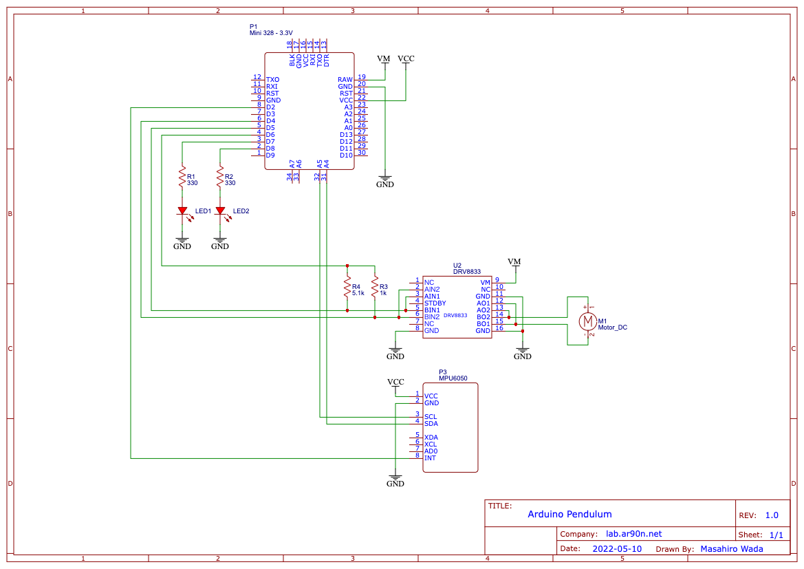

# arduino-pendulum

Plain inverted pendulum with arduino.


## Requirements

* PlatformIO
* Arduino Pro Mini 
* DRV8833 DCモータードライブモジュール(https://www.amazon.co.jp/gp/product/B098Q24ZV9/)
* GY-521 MPU6050 (https://www.amazon.co.jp/gp/product/B081RHK82T/)
* Ren He DC 3-6V ギヤードモーター (https://www.amazon.co.jp/gp/product/B09BCSRXFJ)
* ENEGON 9V 充電式 電池 (https://www.amazon.co.jp/gp/product/B09KTLTZV7)

## Schematic



## Calibration of MPU6050
Use [this sketch](https://github.com/ElectronicCats/mpu6050/blob/master/examples/IMU_Zero/IMU_Zero.ino) to get offset of each axes.
And set these offset to calibrate MPU6050 as followings.

```cpp
mpu.setXAccelOffset(837);
mpu.setYAccelOffset(-939);
mpu.setZAccelOffset(544);
mpu.setXGyroOffset(186);
mpu.setYGyroOffset(-65);
mpu.setZGyroOffset(-28);
```

In this project, this feature is achieved by calibrate method of IMU.


## See Also
* [mpu6060](https://github.com/ElectronicCats/mpu6050)

## License
[Apache-2.0](https://github.com/ar90n/arduino-pendulum/blob/main/LICENSE)
